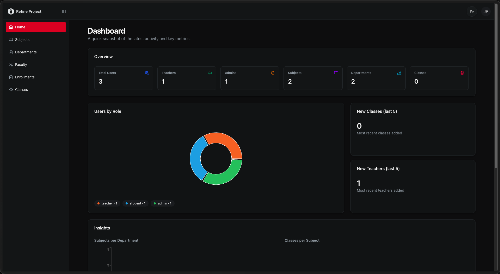

# 🎓 Classroom Admin Dashboard — Frontend

A modern admin dashboard for managing academic systems, including departments, subjects, classes, faculty, and student enrollments. Built with Refine, React, and TypeScript, and integrated with a secure REST API.

**Live Demo:** [classroom-frontend-gules.vercel.app](https://classroom-frontend-gules.vercel.app)  
**Backend Repository:** [github.com/jainilpatel89/classroom_backend](https://github.com/jainilpatel89/classroom_backend)

---

## Screenshots



---

## Features

- Dashboard with real-time system statistics (users, classes, subjects, departments)
- Department, subject, and class creation workflows
- Faculty (users) directory with relational data views
- Enrollment system linking students to classes via invite codes
- Relational data navigation (departments → subjects → classes → users)
- Type-safe forms using React Hook Form and Zod validation
- Integrated data fetching using Refine data provider architecture
- Responsive UI built with Tailwind CSS and shadcn/ui
- Built on a relational data model connecting departments, subjects, classes, and enrollments

---

## Tech Stack

| Technology | Purpose |
|---|---|
| [React](https://react.dev) | Component-based UI library |
| [Refine](https://refine.dev) | Headless framework for admin panels — handles routing, data fetching, and auth |
| [TypeScript](https://www.typescriptlang.org) | Static typing for improved code quality and developer experience |
| [shadcn/ui](https://ui.shadcn.com) | Accessible, reusable component library built on Radix UI |
| [Tailwind CSS](https://tailwindcss.com) | Utility-first CSS framework for responsive styling |
| [Zod](https://zod.dev) | TypeScript-first schema validation for runtime type safety |
| [Vite](https://vitejs.dev) | Fast build tool and dev server |

---

## Getting Started

### Prerequisites
- Node.js v18+
- npm or yarn
- Backend server running locally (see [classroom_backend](https://github.com/jainilpatel89/classroom_backend))

### Installation

1. Clone the repository
```bash
git clone https://github.com/jainilpatel89/classroom_frontend.git
cd classroom_frontend
```

2. Install dependencies
```bash
npm install
```

3. Create a `.env.local` file in the root directory
```
VITE_BACKEND_BASE_URL=http://localhost:3000/api
```

4. Start the development server
```bash
npm run dev
```

The app will be running at `http://localhost:5173`

### Build for Production
```bash
npm run build
```

### Run Production Build
```bash
npm run start
```

---

## Environment Variables

| Variable | Description |
|---|---|
| `VITE_BACKEND_BASE_URL` | Base URL of the backend API |
| `VITE_CLOUDINARY_CLOUD_NAME` | Cloudinary cloud name for media uploads |
| `VITE_CLOUDINARY_UPLOAD_PRESET` | Cloudinary upload preset used for unsigned uploads |
| `VITE_CLOUDINARY_UPLOAD_URL` | Cloudinary upload endpoint URL |

---

## Project Structure

```
src/
├── components/       # Reusable UI components (shadcn/ui + custom)
├── constants/        # App constants
├── hooks/            # Custom React hooks to detect mobile viewports for responsive UI
├── lib/              # Utility functions and Zod schemas
├── pages/            # Page-level components (Dashboard, Subjects, Departments, etc.)
├── providers/        # Refine data provider and API integration
├── types/            # TypeScript types
├── App.tsx           # Root component, Refine config, and routing
└── index.tsx         # Entry point
```

---

## Deployment

Frontend is deployed on **Vercel**. To deploy your own instance:

1. Push your code to GitHub
2. Import the repo into [Vercel](https://vercel.com)
3. Set the `VITE_BACKEND_BASE_URL` environment variable to your deployed backend URL
4. Deploy

---

## Related

- [Backend Repository](https://github.com/jainilpatel89/classroom_backend) — Node.js, Express, Drizzle ORM, Neon PostgreSQL, Better Auth, Arcjet
